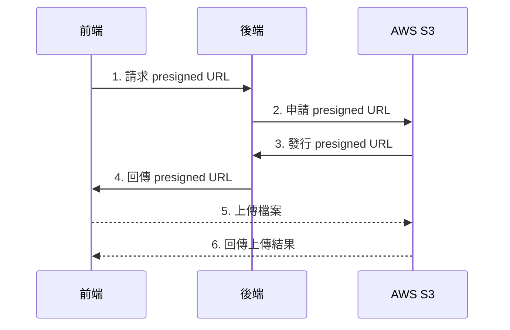
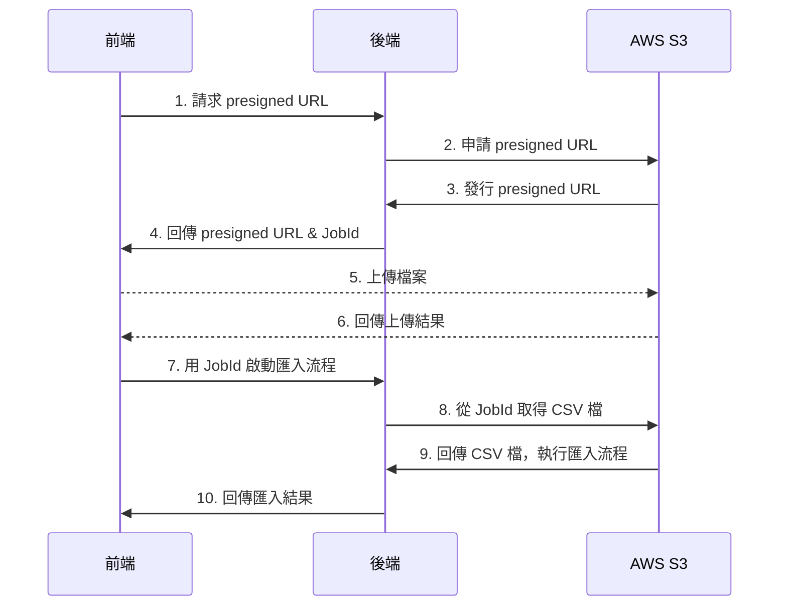

# Sharing 2025.09.11

Jonathan

---
layout: center
---
# Today's sharing
- <Link to="upload-file-size" title="驗證已上傳的檔案大小"/>
- <Link to="presigned-urls" title="Presigned URLs"/>
- <Link to="input-allow-regexp" title="Input Allow Regexp"/>
---
routeAlias: upload-file-size
layout: center
---

# 驗證已上傳的檔案大小

---
layout: image-right
image: /20250911/截圖 2025-09-09 上午10.47.15.png
backgroundSize: 70%
---

# 和以往上傳驗證的差異

- 跨平台複製機器人時，需要針對已上傳檔案大小的檢查
- 以往是上傳前檢查，若超過上限則無法上傳
- 跨平台前後的檔案大小限制不同，故需要針對已上傳的檔案大小進行檢查

---
layout: center
---

# 實作方向

- 取得已上傳檔案的大小
- Zod 全域驗證方式照舊
- 原有影片、圖片的 zod schema 擴充，加入已上傳檔案大小的檢查
---

# 從 header 取得檔案大小

```js {1-4|1-7|8-15}

const url = 'https://images.unsplash.com/photo-1583521214690-73421a1829a9?q=80&w=2070';
const response = await fetch(url, { method: 'HEAD' });
const contentLength = response.headers.get('content-length'); // bytes

console.log(`url bytes size: ${contentLength} bytes`);
// url size: 453444 bytes

const fileSizeInKB = contentLength ? parseInt(contentLength) / 1024 : 0;
console.log(`url KB size: ${fileSizeInKB} KB`);
// url size: 442.8163146972656 KB

const fileSizeInMB = contentLength ? parseInt(contentLength) / 1024 / 1024 : 0;
console.log(`url MB size: ${fileSizeInMB} MB`);
// url size: 0.4324378967 MB

```

---
layout: center
---
# 從 header 取得檔案大小

#### Pros:
  - 不用下載檔案
  - 直接取得檔案大小

<div class="my-6" />

#### Cons:
  - CDN 可能不支援 HEAD Method
  - 單位只有 bytes

---
layout: center
---

### 後端表示：
## S3 SDK 有提供方法可以查檔案大小

---

# 從 metadata API 取得檔案大小

```js {1-7|all}
// /niffler/src/restapi/bot.js

export default {
  getFileSize(fileUrl) {
    return camelotApiHelper.get(`/v1/file/s3/metadata?url=${fileUrl}`);
  }
}

const url = 'https://uat-media-cdn.omnichat.ai/upload/photos/user-upload-photo/5c83f83e-4d89-4cac-b7a7-697cfefbe64a-abf7e675259f4bf098eea613627cf67f.jpg';

const { data: { content } } = await getFileSize(url);

console.log(content);
// {
//   "bytes": 453444,
//   "megabyte": 0.43
// }
```

---

# Use

```ts {1-12|13-19|21-28}{maxHeight:'400px'}
// /niffler/src/views/BotBuilder/composable/useMessageBlockSchemaValidation/fileSizeUtils.ts

export async function buildFileSizeMapForSchemaValidation({ messageBlocks, urlPropertyName, sizeMapRef}) {
  const fileUrls = new Set<string>();
  
  messageBlocks.forEach((block) => {
    recursivelyVisitObject(block, (value) => {
      if (value[urlPropertyName]) {
        fileUrls.add(value[urlPropertyName]);
      }
    });
  });

  const urlArray = Array.from(fileUrls);
  
  const sizesPromises = urlArray.map(url => 
    getFileSizeFromUrl(url).then(size => ({ url, size }))
  );
  
  try {
    const results = await Promise.all(sizesPromises);
    const sizeMap = new Map<string, number>();
    
    results.forEach(({ url, size }) => {
      sizeMap.set(url, size);
    });
    
    sizeMapRef.value = sizeMap;
  } catch (error) {
    console.error('Failed to build file size map:', error);
  }
}
```

---

# Validate file size by refine schema

```ts {all}
chatbotVideoSchema.refine((data) => {
  const fileSize = sizeMapRef.value.get(data.videoUrl) || 0;
  const maxSizeInBytes = platformLimits[platform]

  return fileSize <= maxSizeInBytes || fileSize === 0;
}, {
  message: 'File size is too large',
  path: ['videoUrl'],
});

```

---
routeAlias: presigned-urls
layout: center
---

# Presigned URLs

---
layout: center
---

# Presigned URLs？

- 允許使用者在沒有驗證的情況下，直接從指定 S3 bucket 上傳 / 下載檔案的網址
- 上傳 / 下載的條件由後端申請 presigned URL 時決定
- 具有時效性，過期後無法使用
- 前端上傳 / 下載檔案時，不經過後端

<!-- http method、content-type、content-length 等限制由後端申請 presigned URL 時決定 -->

---
layout: center
---

### Presigned URLs Upload flow

<div class="my-6" />



---
layout: center
---

### Presigned URLs Upload & Import tags flow

<div class="my-6" />



---

# Implementation

```ts {1-5|6-10|11-14}

// 1. 請求 presigned URL
const { data } = await tagsApi.getPresignedUrl();
jobId.value = data.content.jobId;
presignedUrl.value = data.content.presignedUrl;

// 5. 上傳檔案
const res = await fetch(presignedUrl.value, {
  method: 'PUT',
  body: file.value
});

// 7. 用 JobId 啟動匯入流程
if (res.ok) {
  await handleStartTagImportJob();
}

```

---
routeAlias: input-allow-regexp
layout: center
---

# Input Allow Regexp

---
layout: center
---

# 需求

##### OCPD-22400 串接 LINE 渠道 | 輸入 Channel ID 時僅可輸入數字
- 該 Input 只能輸入數字

---
layout: center
---

# 實際需求

- 儲存類型為字串
- 雖然只能輸入數字，但不包含 -, e, . 等數學符號
- 其實是要限制只能鍵入 0~9 的字串

---
layout: center
---

# 嘗試過的方法

- Input type: number
- blur & input event 處理 value

---
layout: center
---

# Input 新增 Allow Regexp 屬性

```vue
<template>
  <Input
    v-model="channelId"
    label="Channel ID"
    auto-grow
    :maxlength="60"
    class="right-input"
    :hide-details="false"
    :allow-regexp="/^[0-9]+$/"
  />
</template>
```


---
layout: center
---

<div class="flex flex-col items-center justify-center h-full">
  <h1>The end</h1>
  <PoweredBySlidev />
</div>